<p align="center">
  <picture>
    
  </picture>
</p>

<p align="center">
  
  
  
</p>

---

**VSTea** is a cross-platform utility that scans your installed DAWs (Digital Audio Workstations) to create a comprehensive list of your audio plugins (VST2, VST3, AU, CLAP).

Instead of just guessing based on hard drive folders, VSTea parses the actual configuration files, databases, and registries of the DAWs themselves. This provides an accurate, deduplicated snapshot of what is actually detected and working in your production environment.

## 📥 Download & Installation

You don't need to install Python or mess with the terminal to use VSTea. 
Pre-built binaries are generated automatically via GitHub Actions for all major operating systems.

1. Go to the [Releases Page](../../releases/latest).
2. Download the version for your system:
   * **Windows:** `VSTea-Windows.exe`
   * **macOS:** `VSTea-macOS.zip` (Extract and drag to Applications)
   * **Linux:** `VSTea-Linux` (Make executable and run)

### ⚠️ Note on Security Warnings (Windows & macOS)
Because VSTea is a free, open-source indie tool, it doesn't use expensive enterprise code-signing certificates. Your OS might flag it as an "unrecognized app" upon first launch. All code is public and built transparently via GitHub Actions. Here is how to bypass the warnings:

* **🪟 Windows:** If you see a blue "Windows protected your PC" popup, click **More info**, then click **Run anyway**.
* **🍎 macOS:** If macOS says the app cannot be opened or is damaged, click **OK**. Open your Mac's **System Settings > Privacy & Security**, scroll down to the Security section, and click **Open Anyway** next to VSTea.

## 🎯 Why VSTea?

Musicians and producers often suffer from "Plugin Acquisition Syndrome." It's easy to lose track.
* **Inventory:** What plugins do I actually own and have installed right now?
* **Migration:** Moving to a new computer? VSTea generates an interactive checklist so you don't forget essential tools.
* **Diagnostics:** Why does a plugin show up in FL Studio but not in Ableton? VSTea helps you compare detection status across your installed DAWs.

## ✨ Features

* **Multi-DAW Support:** Scans configurations for Ableton Live, Reaper, Cubase, Logic Pro, FL Studio, Bitwig, and Studio One.
* **Smart Merging:** Combines lists from multiple DAWs to close gaps and perfectly remove duplicates.
* **Format Agnostic:** Detects VST2, VST3, Audio Units (AU), CLAP and more.
* **HTML Reports:** Generates a beautiful, searchable, and interactive HTML file of your collection.
* **Modern GUI:** A clean, responsive desktop interface built with Qt (PySide6).

## 🛠 Tech Stack & Architecture

VSTea is built with **Python** and features a modular architecture:
* **Frontend:** Modern desktop UI powered by `PySide6` (Qt).
* **DAW Parsers:** Specific modules to read proprietary DAW formats (XML, SQLite, JSON, INI, gzip).
* **Core Logic:** Normalizes data (e.g., matching "Pro-Q 3" with "FabFilter Pro Q3") and handles threads/deduplication.
* **Exporters:** `Jinja2` templates for generating the frontend HTML reports.

---

## 💻 For Developers (Manual Installation)

If you want to contribute or run VSTea from source:

```bash
# Clone the repository
git clone [https://github.com/Karaatin/vstea.git](https://github.com/Karaatin/vstea.git)
cd vstea

# Create a virtual environment (recommended)
python -m venv venv
source venv/bin/activate  # or venv\Scripts\activate on Windows

# Install dependencies
pip install -r requirements.txt

# Run the app
python main.py
